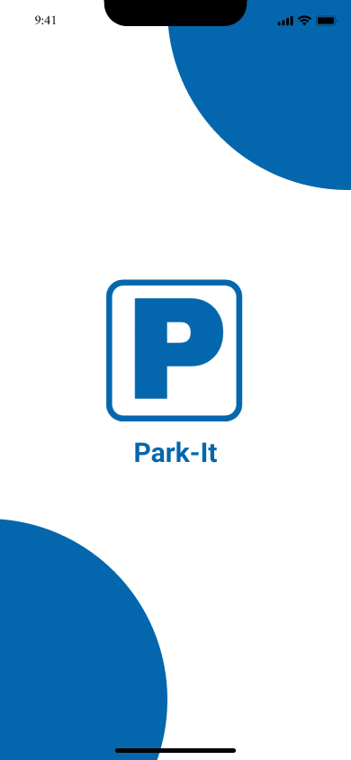
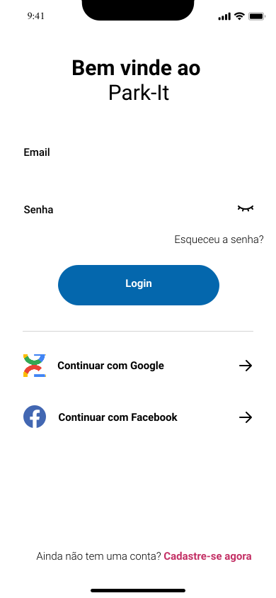
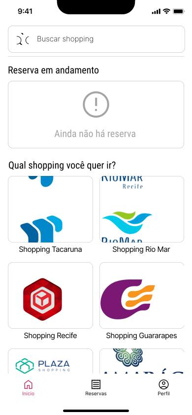

<h1 align="center">Park-It</h1>

<h3 align="center">
    🚗 Seu aplicativo de reserva de vagas. Ajudamos pessoas a resolverem problemas com vagas de forma eficiente. 💖
</h3>
  
</p>

Tabela de conteúdos
=================
   * [Sobre o projeto](#-sobre-o-projeto)
     * Benefícios
   * [Layout](#-layout)
     * Telas
   * [Como executar o projeto](#-como-executar-o-projeto)
     * [Pré-requisitos](#pré-requisitos)
     * [Rodando o main.py](#-rodando-o-main.py)
   * [Ferramentas](#-ferramentas)
   * [Contribuidores](#-contribuidores)

### 💻 Sobre o projeto

Park-It 🚗: é uma forma de facilitar a vida dos usuários, pois possui um sistema intuitivo e prático de reserva de vagas, com objetividade para encontrar a vaga reservada e por um valor justo.

Projeto desenvolvido durante a disciplina de **Projetos 1** presente nos cursos de CC e Design da [CESAR School](https://www.cesar.school/).

---

### ⚙️ Benefícios

- [x] Para clientes:
  - [x] Otimização do deslocamento;
  - [x] Economia de tempo;
  - [x] Facilidade para se localizar dentro de estacionamentos;
  - [x] Conforto 

- [x] Para os shoppings:
  - [x] Economia com placas de sinalização; 
  - [x] Maior satisfação do cliente;
  - [x] Retorno financeiro de um valor da reserva da vaga

---

### 🎨 Layout

O layout da aplicação está disponível no Figma:

<a href="https://www.figma.com/file/cTrUrQRjeA1Emni3fBkZ3x/Park-It?t=XV19CuVurGtJTO15-0">
  
</a>


### Telas

<p align="center">
  

  
  
  
  
  
</p>

---

### 🚀 Como executar o projeto

Este projeto é divido em três partes:

1. main.py 
2. Funções (pasta utils)
3. Dados (pasta database)

💡 → Para o código funcionar perfeitamente, basta rodar o arquivo main.py. <br />
<br />
💡 → Talvez seja necessário mudar os paths dos dados nos seguintes arquivos: 

→ cadastro_usuario.py (usar o caminho do arquivo cadastro.txt, que encontra-se dentro da pasta database) <br />
→ historico_reserva.py (usar o caminho do arquivo historico_reserva.cvs, que encontra-se dentro da pasta database)

### 📝 Pré-requisitos

Antes de começar, você vai precisar ter instalado: <br />
[VSCode](https://code.visualstudio.com/) <br />
[Biblioteca Pandas](https://pandas.pydata.org/)  <br />
Certifique-se também que os arquivos .csv e .txt estejam com o caminho correto do seu pc

### 🎲 Rodando o main.py

💡 → Só apertar o play e ser feliz 😁

```
import os
os.system('cls')

from utils.bem_vindo import boas_vindas
from utils.cadastro_usuario import registro
from utils.menu_logado import selecionar_menu_logado
from utils.shopping import selecionar_shopping
from utils.loja import escolher_loja
from utils.vaga import selecionar_vaga
from utils.confirmar import confirmar_vaga
from utils.sair_vaga import sair_vaga
from utils.historico_reserva import registrar_historico
from utils.historico_reserva import visualizar_historico

bem_vindo = boas_vindas()
usuario_logado, cliente_id = registro()
menu_logado = 0

while menu_logado != 3:
    menu_logado = selecionar_menu_logado(usuario_logado)
    
    if menu_logado == 1: 
        escolha_shopping, shopping_nome = selecionar_shopping()
        escolha_loja, loja_nome = escolher_loja(escolha_shopping)
        vaga_id = selecionar_vaga(escolha_shopping, escolha_loja)
        reserva_chegada_confirmada, reserva_data, reserva_chegada_hora = confirmar_vaga()
        reserva_saida_hora = sair_vaga(usuario_logado)
        registro_historico = registrar_historico(cliente_id, shopping_nome, loja_nome, vaga_id, reserva_chegada_confirmada, reserva_data, reserva_chegada_hora, reserva_saida_hora)
    
    elif menu_logado == 2: 
        acessar_historico = visualizar_historico(cliente_id)
```
---

### 🛠 Ferramentas

As seguintes ferramentas foram usadas na construção do projeto:

-   Protótipo:  **[Figma](https://www.figma.com/)**  →  **[Protótipo (Park-It)](https://www.figma.com/file/cTrUrQRjeA1Emni3fBkZ3x/Park-It?t=XV19CuVurGtJTO15-0)**
-   Editor:  **[Visual Studio Code](https://code.visualstudio.com/)**  → Lib:  **[Pandas](https://pandas.pydata.org/)**
-   Ícones:  **[Iconify](https://iconify.design/)**
-   Fontes:  **[Roboto](https://fonts.google.com/specimen/Roboto)**, **[Roboto Condensed](https://fonts.google.com/specimen/Roboto+Condensed??query=roboto)**, **[Inter](https://fonts.google.com/specimen/Inter)** 

---

### 👨‍💻 Contribuidores

💞 Um super obrigado(a) para essa galera que fez esse projeto sair do papel e ajudou a transforma-lo no que é agora :)

<table>
  <tr>
    <td align="center"><br /><sub><b>Carlos Augusto</b></sub></a><br /></a></td>
    <td align="center"><br /><sub><b>Cristina Matsunaga</b></sub></a><br /></a></td>
    <td align="center"><br /><sub><b>Ester Carvalho</b></sub></a><br /></a></td>
    <td align="center"><br /><sub><b>Luiz Felipe</b></sub></a><br /></a></td>
    <td align="center"><br /><sub><b>Ivy Pires</b></sub></a><br /></a></td>
    <td align="center"><br /><sub><b>Matheus Canel</b></sub></a><br /></a></td>
    
  </tr>
  <tr>
    <td align="center"><br /><sub><b>Thiago Araújo</b></sub></a><br /></td>
    <td align="center"><br /><sub><b>Clarice Medeiros</b></sub></a><br /></td>
    <td align="center"><br /><sub><b>Leonardo Lima</b></sub></a><br /></td>
    <td align="center"><br /><sub><b>Marinna Santos</b></sub></a><br /></td>
    <td align="center"><br /><sub><b>Yanne Lopes</b></sub></a><br /></td>
    
  </tr>
</table>
